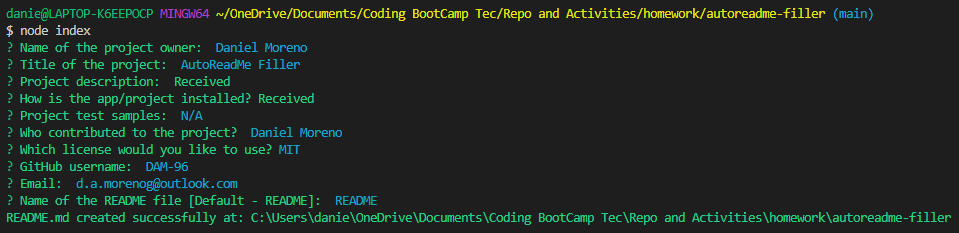

  # AutoReadMe Filler

  ## Description
  This project is aimed to help other users create README files in an easier, reliable and profesional manner using a simple terminal application. The application consists on a questionaire that, once answered, a readme file with the `.md` extension will be generated with the information that was input into the terminal application.

  ## Table of contents
  * [Installation](#installation)
  * [Usage](#usage)
  * [Image](#image)
  * [Tests](#tests)
  * [Contributing](#contributing)
  * [License](#license)
  * [Questions](#questions)
  
  ## Installation
- Clone the GitHub repo into your local computer
- Open the terminal on the repo's folder
- Run `npm i` to install the application's node modules
- Run the application with `node index`
- A readme file will be created or overwritten with the name input inthe app

## Usage
 Run `node index` in a terminal on the 

## Image

## Contributing
  Daniel Moreno

## License
*License Start*
  
  *Copyright (C) 2022 Daniel Moreno*
  
  
Permission is hereby granted, free of charge, to any person obtaining a copy of this software and associated documentation files (the "Software"), to deal in the Software without restriction, including without limitation the rights to use, copy, modify, merge, publish, distribute, sublicense, and/or sell copies of the Software, and to permit persons to whom the Software is furnished to do so, subject to the following conditions:

The above copyright notice and this permission notice shall be included in all copies or substantial portions of the Software.

THE SOFTWARE IS PROVIDED "AS IS", WITHOUT WARRANTY OF ANY KIND, EXPRESS OR IMPLIED, INCLUDING BUT NOT LIMITED TO THE WARRANTIES OF MERCHANTABILITY, FITNESS FOR A PARTICULAR PURPOSE AND NONINFRINGEMENT. IN NO EVENT SHALL THE AUTHORS OR COPYRIGHT HOLDERS BE LIABLE FOR ANY CLAIM, DAMAGES OR OTHER LIABILITY, WHETHER IN AN ACTION OF CONTRACT, TORT OR OTHERWISE, ARISING FROM, OUT OF OR IN CONNECTION WITH THE SOFTWARE OR THE USE OR OTHER DEALINGS IN THE SOFTWARE.

  **Link:** https://www.mit.edu/~amini/LICENSE.md
  
*License End*

  ## Questions
  For any questions you can contact us through any of the following 

  **GitHub:** https://github.com/DAM-96 

  **Email:** d.a.morenog@outlook.com 

